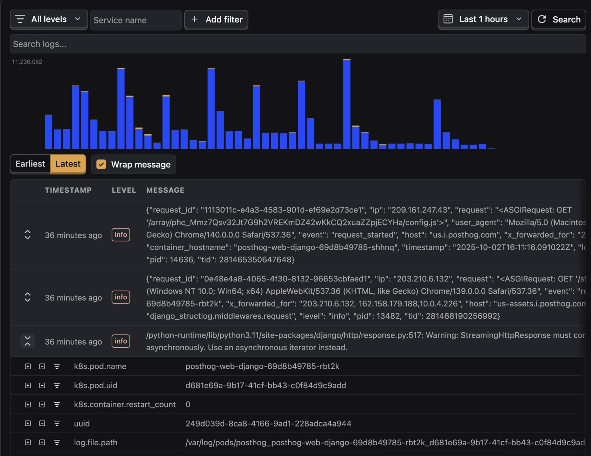
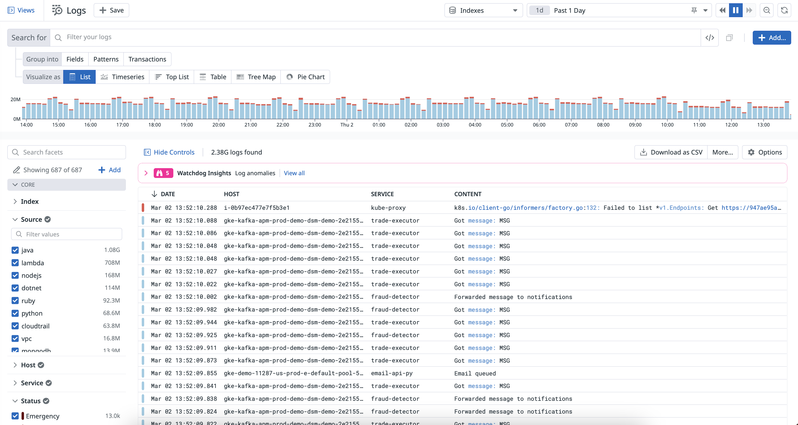
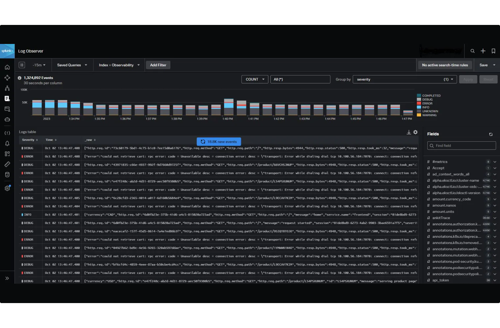
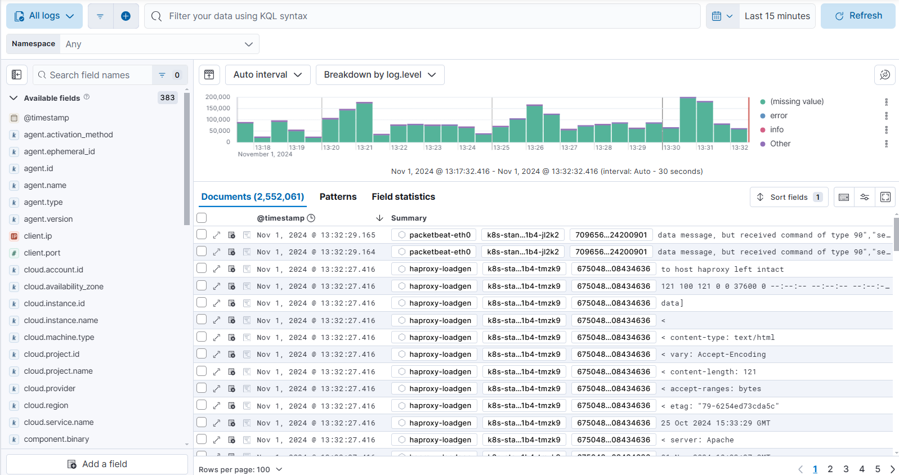
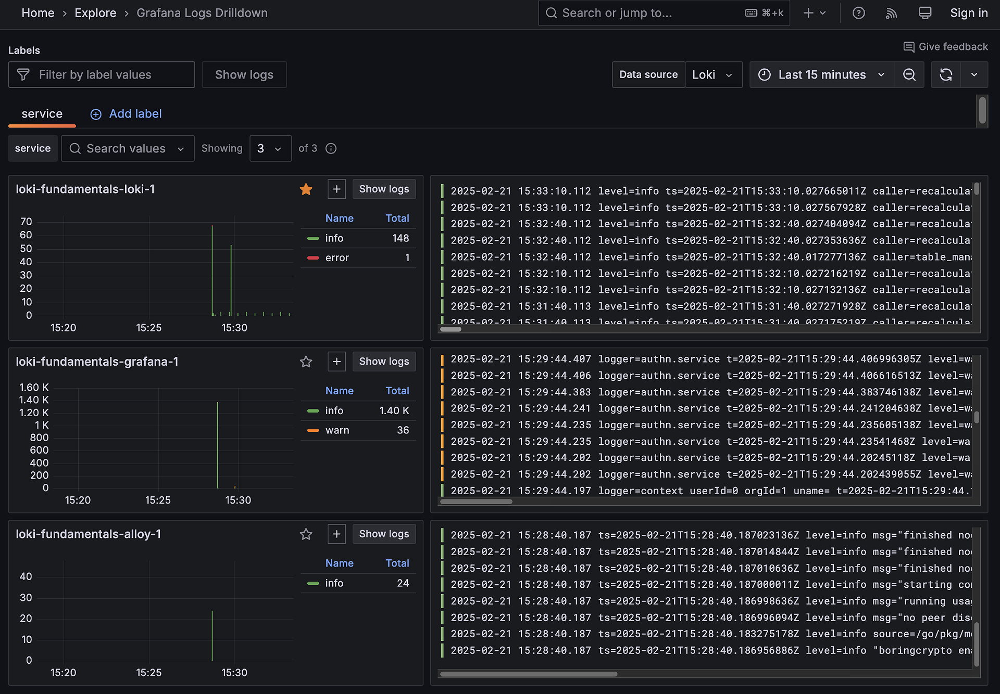
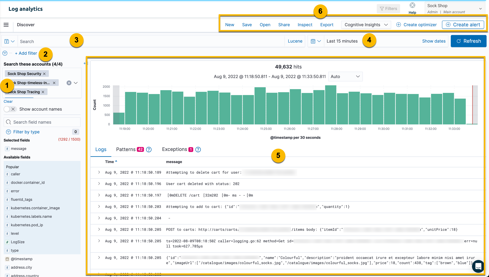
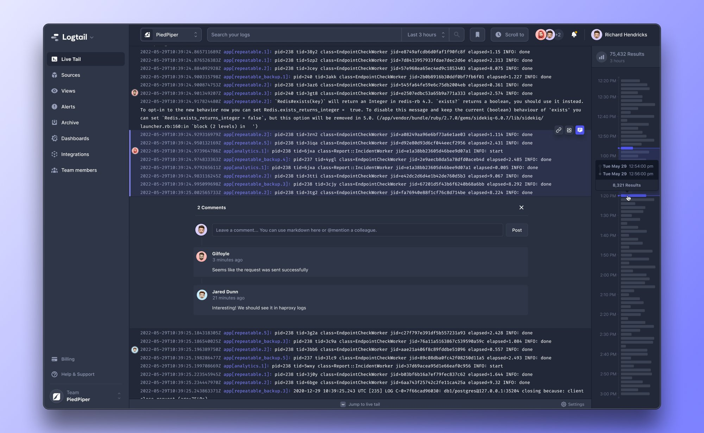

Your API throws a 500 error. Is it the new deployment, a bad dependency, or something deeper? Without log monitoring, you're guessing. With the wrong log monitoring tool, you're paying to guess a bit faster.

For developers, SREs, and DevOps teams, log monitoring helps eliminate those guesses by collecting, searching, and analyzing log data across applications and infrastructure.

The best log monitoring tools give you more than raw log lines – they make it easy to understand what happened before the error, which systems were involved, and what triggered it.

This guide compares the best log monitoring tools, outlines which features matter most when choosing one, and identifies who each tool is built for – so you can pick the right fit for your team.

## What features do you need in a log monitoring tool?

At the bare minimum, good log monitoring tools should offer:

- Log ingestion from multiple sources (agents, APIs, and OTLP)

- Full-text search and filtering

- Tiered log retention

- Centralized dashboards and real-time visualization

- Alerting and notification

The best monitoring tools go further to provide:

- **OpenTelemetry support:** Enables standardized log ingestion so you can switch between log monitoring tools without rewriting your application logic. It also enriches your logs with trace and span IDs, so you can trace an error back to the exact request that triggered it.

- **Structured logging:** Enables you to filter and query logs by specific fields – user ID, status code, or service name – rather than parsing raw text strings.

- **Correlation with traces and metrics:** Useful for connecting logs to related traces and metrics, so you can track performance issues or errors back to the events that caused them.

- **Query language depth:** Goes beyond basic keyword search and allows you to aggregate and analyze log data – making it easier to identify patterns, investigate incidents, and understand the root cause of recurring issues.

- **RBAC and audit logs:** Useful for regulatory compliance and security audits, so you can control who views, exports, or manages logs across teams and environments - and get insights into who ran a specific search or extracted sensitive data.

Here's how some of the best log monitoring tools compare:

|            | PostHog | Datadog  | Splunk  | Elastic  | Grafana loki  | OpenSearch  | Better Stack |
|---         | ---     | ---      | ---     | ---      | ---           | ---         | ---         |
|**OpenTelemetry support**  Ingest logs using the OTel standard without vendor-specific SDKs | ✅    | ✅  | ✅  | ✅  | ✅   | ✅ | ✅  |
|**Self hosting**  Deploy and manage tool on your own infrastructure | ✅   | ❌  | ✅  | ✅  | ✅   | ✅ | ❌  |
|**Free tier**  Offer permanent free usage without a credit card | ✅    | ❌  | ❌  | ✅  | ✅   |  ✅  |  ✅  |
|**Open source**  Code-base is publicly available and open to contributors | ✅    | ❌  | ❌ | ✅   | ✅   | ✅  | ❌  |
|**Transparent pricing**  Pricing is publicly listed without requiring a sales call | ✅  | ✅  | ❌   | ✅   |  ✅  | ✅  | ✅  |
|**RBAC & Audit logs**  Control who accesses logs and track who ran queries or exported data | partial | ✅  | ✅  | ✅  | partial | ✅ | ✅  |
|**Retention logs**  How long logs are stored and searchable by default | ✅ | ✅  | ✅  | ✅   |  ✅  | ✅ | ✅  |
|**Alerting**  Get notified when specific log patterns or thresholds are triggered |  ✅   | ✅  |  ✅ |  ✅  |  ✅  | ✅ | ✅  |
|**Correlation with traces and metrics** Navigate from a log directly to the related trace or infrastructure metric |  ❌   | ✅ | ✅  |  ✅   |  ✅  | ✅ | ✅  |

## What's the best log monitoring tool?

### 1. PostHog

PostHog is an all-in-one platform that brings [centralized log monitoring](https://posthog.com/logs) to the same workspace as your [product analytics](https://posthog.com/product-analytics), [session replay](https://posthog.com/session-replay), [error tracking](https://posthog.com/error-tracking), [AI observability](https://posthog.com/ai-observability), and [feature flags](https://posthog.com/feature-flags) – so you can debug user-facing issues without switching between multiple tools.

PostHog Logs only reached general availability in January 2026, yet it offers a unique debugging experience - frontend logs collected through PostHog JS are automatically connected to User IDs and session replays, making it possible to trace issues from a user's browser session to related backend events. It also includes an [AI-powered](https://posthog.com/ai) log search and summarization to help teams investigate issues faster.

**Strengths:**

- All-in-one workspace – logs, analytics, session replay, error tracking, AI observability, and feature flags

- Frontend and backend logs linked to users and session replays automatically

- OTel-native ingestion – no proprietary SDKs required

- AI-assisted log search, summary, and debugging

- Transparent [usage-based pricing](https://posthog.com/pricing) with 50 GB free per month

**Community:**

- PostHog is fully open source under the MIT license, with the codebase publicly available and maintained on [GitHub](https://github.com/PostHog/posthog).

- The repository has 34.9k+ stars and 502+ contributors, with multiple commits per day from the community and team members.

- Product decisions and roadmap updates are shared [publicly](https://posthog.com/changelog).

<CalloutBox icon="IconStarFilled" title="PostHog is best for..." type="fyi">

Developers who want logs, analytics, session replay, feature flags, and error tracking in a single workspace. It's also great for teams that want a generous free-tier offer, along with AI assisted log search and debugging.

</CalloutBox>

<WizardCTA />

### 2. Datadog

Datadog understood the limitations of traditional logging and addressed them through its "Logging without Limits" architecture. This enables you to decouple log ingestion from indexing so your team can ingest all logs, then decide what to index and what to archive.

Datadog also sets a strong standard for unifying the three pillars of observability – logs, metrics, and traces – enabling your team to move from a metric spike directly to the related log that explains it, without switching tools. With 1,000+ integrations across cloud providers, services, and infrastructure tools, it is one of the most connected platforms in the category. Log management, however, is billed separately from its infrastructure – [$0.10/GB ingested, and $1.70 per million events indexed](https://www.datadoghq.com/pricing/?product=log-management#products), and costs can compound quickly at scale. 

**Strengths:**

- "Logging without Limits" – ingest everything, index selectively

- Mature log, metric, and trace correlation in a single view

- 1,000+ integrations across cloud providers, services, and tools

- Enterprise-grade alerting, anomaly detection, and compliance features

- AI-powered investigation via Watchdog and Bits AI

**Community:**

- Datadog's core product is closed-source (proprietary).

- It maintains several open-source components and client libraries, including [datadog-agent](https://github.com/DataDog/datadog-agent) (3.6k+ stars, 779+ contributors) and [integrations-core](https://github.com/DataDog/integrations-core) (1.1k+ stars, 1,068+ contributors).

<CalloutBox icon="IconStarFilled" title="Datadog is best for..." type="fyi">

Engineering and SRE teams that need mature log, metric, and trace correlation in one place – and have the budget to match. it's also a strong choice for teams that rely on a large ecosystem of integrations.

</CalloutBox>

### 3. Splunk

Splunk (now owned by Cisco) distinguishes itself from other log monitoring tools with its schema-on-read architecture. Rather than requiring structured data upfront, it collects logs exactly as they are – structured, semi-structured, or unstructured – and returns them in a structured format at query time. This makes it a strong fit for teams dealing with logs of various formats and diverse sources.

Splunk's Search Processing Language (SPL2) is one of the most powerful query language in the log management space, enabling your team to sift through millions of events, pinpoint root causes, visualize results in charts and graphs, and set up automated alerts – all from a single centralized logging platform. Pricing isn't publicly listed and varies by model, so you'll need to [contact sales](https://www.splunk.com/en_us/products/pricing.html) for a quote.

**Strengths:**

- Schema-on-read architecture – ingest any log format without upfront parsing

- SPL – one of the most powerful log analysis query languages in the category

- Unified platform for log monitoring and security analytics (SIEM)

- Real-time search and processing at enterprise scale

- Self-hosting option available for on-premises deployments

**Community:**

- Splunk's core platform is proprietary.

- It maintains several open source components on [GitHub](https://github.com/splunk), 
including security tools and SDKs like [splunk-sdk-python](https://github.com/splunk/splunk-sdk-python)(736+ stars, 80 contributors) and [attack_range](https://github.com/splunk/attack_range) (2.5k+ stars, 48 contributors).

- Splunk has a large enterprise community with an active forum, annual conference, and thousands of apps on Splunkbase.

<CalloutBox icon="IconStarFilled" title="Splunk is best for..." type="fyi">

Enterprises handling massive log volumes across diverse systems that need deep security analytics, compliance capabilities, and advanced log investigation.

</CalloutBox>

### 4. Elastic

Elastic brings the world’s most popular search engine to log monitoring. Built on Elasticsearch, it can ingest and search through petabytes of log data in near-real time, making it a strong choice for teams looking to investigate incidents across massive environments.

Its superpower is flexibility. With Elastic, you can build custom dashboards, define your own data models, and run complex searches across both structured and unstructured logs using ES|QL - its powerful query language. This makes it a strong choice if you want full control over how your log data is collected, processed, and analyzed – whether self-hosted or via [Elastic Cloud](https://www.elastic.co/pricing).

**Strengths:**

- Search petabytes of log data in near-real time

- ES|QL for advanced log aggregation and analysis

- Fully customizable pipelines, schemas, and dashboards

- AI-assisted anomaly detection and log categorization

- OpenTelemetry-native ingestion via the Elastic Agent and EDOT

**Community:**
 
- Elastic operates a multi-license model with open source options under the AGPL license alongside proprietary tiers.

- Its GitHub organization holds some of the largest repositories in the search and observability ecosystem, including [Elasticsearch](https://github.com/elastic/elasticsearch) (76.9k+ stars, 2,149+ contributors) and [Kibana](https://github.com/elastic/kibana) (21.1k + stars, 1,205+ contributors).

- Elastic maintains a large global community through its [Discuss forums](https://discuss.elastic.co/), contributor ecosystem, community events, and extensive marketplace of integrations and plugins.

<CalloutBox icon="IconStarFilled" title="Elastic is best for..." type="fyi">

Teams that want powerful search capabilities and complete control over how log data is collected, processed, stored, and queried.

<CalloutBox>

### 5. Grafana Loki

Grafana Loki is a log monitoring system designed for horizontal scalability and multi-tenant log aggregation. It is built for teams that need to handle large volumes of logs without letting storage costs grow out of control.

Its biggest strength lies in cost-efficient scalability. Rather than indexing every log line, Loki indexes only log metadata - enabling your team to keep storage requirements low, while making it possible to retain large amounts of log data and scaling your infrastructure without a significant increase in operational cost. If you prefer a managed option, [Grafana Cloud](https://grafana.com/pricing/) offers 50 GB free per month, with Pro plans starting at $19/month.

**Strengths:**

- Cost-efficient log retention at scale

- Horizontally scalable architecture

- Multi-tenant deployments with tenant isolation

- Native integration with Grafana and Prometheus ecosystems

- Flexible LogQL queries and alerting

**Community:**

- Grafana Loki is fully open source, under the AGPLv3 license, and maintained publicly on [GitHub](https://github.com/grafana/loki) under the Grafana ecosystem.

- The repository has 28.3k+ stars and 1,255+ contributors, with active development from both Grafana Labs and community maintainers.

- Loki benefits from Grafana's large observability community, with extensive documentation, [community forums](https://community.grafana.com/c/grafana-loki/41), and ecosystem integrations.

<CalloutBox icon="IconStarFilled" title="Grafana Loki is best for..." type="fyi">

Fast-growing teams handling large log volumes that want to keep storage costs predictable. It's also a natural fit for teams already invested in Grafana and Prometheus.

</CalloutBox>

### 6.	OpenSearch

OpenSearch is a community-driven, open-source search and log analytics platform forked directly from Elasticsearch. It is built for teams who want Elasticsearch capabilities while retaining full control over their logging stack, without being tied to restrictive commercial licensing models or proprietary vendor lock-in.

OpenSearch is closely integrated with the AWS ecosystem, particularly through the managed [Amazon OpenSearch Service](https://aws.amazon.com/opensearch-service/). Rather than spending time configuring complex log shippers, it gives you a ready-to-use, cloud-native pipeline that reduces infrastructure management overhead and enables you to focus on troubleshooting and optimizing your application instead. OpenSearch is free to self-host – if your team prefers a managed option, you can use [Amazon OpenSearch Service](https://aws.amazon.com/opensearch-service/pricing/), with pricing based on instance type and storage.

**Strengths:**

- Scalable full-text log search without vendor lock-in

- PPL and SQL for flexible log querying and event analytics

- Built-in alerting, anomaly detection, and forecasting

- OpenTelemetry-native ingestion via Data Prepper

- Full observability stack – logs, metrics, and traces in one platform

**Community**

- OpenSearch is fully open-sourced under the Apache 2.0 license, allowing free use, modification, distribution, and sale.

- It is actively maintained on [GitHub](https://github.com/opensearch-project/OpenSearch) with 13.1k+ stars and 496+ contributors.

- The community is driven by the Linux Foundation's OpenSearch Software Foundation, which manages a global developer ecosystem using public Slack channels, user forums, and a community-built marketplace for ingestion and dashboard plugins.

<CalloutBox icon="IconStarFilled" title="OpenSearch is best for..." type="fyi">

Teams that wants Elasticsearch search capabilities without the tradeoff of proprietary vendor lock-in. It's also a strong choice for organizations already invested in the AWS ecosystem.

<CalloutBox/>

### 7. Better Stack

Better Stack connects log management with uptime monitoring, incident management, on-call scheduling, and status pages in a single platform — making it one of the most operationally complete log monitoring tools on this list. 

Its greatest strength is simplicity. Rather than switching between multiple tools to monitor systems, investigate alerts, manage incident response, and communicate outages, you can handle everything from a single platform. [Pricing](https://betterstack.com/pricing) starts at $25/month and includes a generous free tier.

**Strengths:**

- Unified platform – logs, uptime monitoring, incident management, on-call scheduling, and status pages in one place
- Fast error response – move from error log to incident declaration without switching tools
- Simplicity and ease of setup with low operational overhead compared to self-hosted alternatives

**Community:**

- Better Stack's core platform is closed-source (proprietary), but it maintains several open-source [components and libraries](https://github.com/BetterStackHQ)
- Each repo has several stars and contributors, with frequent updates from team and community members

<CalloutBox icon="IconStarFilled" title="Betterstack is best for..." type="fyi">

Teams that want a simple operational platform combining logs, uptime monitoring, incident management, on-call scheduling, and status pages in one place.

</CalloutBox>

## Which  log monitoring tool should you choose?

- Want an all-in-one platform that connects logs to product analytics, session replays, error tracking, AI observability, and feature flags? Go with **PostHog**.

- Want to avoid context-switching and move directly from an error to the exact log line causing it? Use **Datadog**.

- Need a mature platform for security operations, compliance audits, and large-scale log analysis? Go with **Splunk**.

-  Need deep search capabilities and complete control over how your logs are stored, processed, and queried? Go with **Elastic**.

- Want to handle massive log volumes without the cost tradeoff? Try **Grafana Loki**.

-  Need deep search capabilities with strong AWS integration and the flexibility of open source? Choose **OpenSearch**.

- Need powerful log monitoring without the operational overhead of traditional observability platforms? Choose **Better Stack**.

### Recommendations by team types

#### For solo developers and side projects

- **PostHog** if you want to go from a log error to a session replay of exactly what the user did — without juggling multiple free-tier accounts or SDKs

- **Better Stack** if you want logs, uptime monitoring, and incident alerts set up in minutes — with no configuration overhead standing between you and shipping

#### For early-stage startups

- **PostHog** if you want [logs](https://posthog.com/logs), [product analytics](https://posthog.com/product-analytics), [session replay](https://posthog.com/session-replay), [error tracking](https://posthog.com/error-tracking), [AI observability](https://posthog.com/ai-observability), and [feature flags](https://posthog.com/feature-flags) in one platform instead of managing multiple tools

- **Better Stack** if you want logs, uptime monitoring, incident management, and status pages without dedicating time to build observability infrastructure while your team is still small

#### For scaling teams

- **Datadog** if you need mature log-metric-trace correlation across multiple services and want 1,000+ integrations with cloud providers and infrastructure tools out of the box

- **Grafana Loki** if your log volumes are growing fast and you want to keep storage costs low without sacrificing your ability to query and retain large amounts of log data

- **Elastic** if you need near-real-time search across massive log volumes and want full control over how your data is collected, processed, and analyzed

- **OpenSearch** if you want Elasticsearch-level search capabilities at scale without vendor lock-in — especially if you're already running on AWS

#### For SREs managing infrastructure at scale

- **Grafana Loki** if you're already in the Grafana and Prometheus ecosystem and need horizontally scalable, multi-tenant log aggregation that keeps storage costs predictable

- **OpenSearch** if you need full-text log search across a full observability stack — logs, metrics, and traces — with built-in anomaly detection and forecasting

- **Elastic** if you need advanced log aggregation, customizable pipelines, and AI-assisted anomaly detection across petabytes of infrastructure data

- **Splunk** if you need to ingest logs in any format without upfront parsing, investigate incidents across millions of events, and run security analytics alongside log monitoring

#### For enterprises with compliance needs

- **Splunk**  if you need a unified platform for log monitoring and security analytics (SIEM), with deep investigation capability and the ability to ingest any log format without upfront structuring

- **Elastic** if you need enterprise-grade RBAC, audit logs, and advanced queries — with the flexibility to self-host or use Elastic Cloud depending on your data sovereignty requirements

- **OpenSearch** if you need FedRAMP, HIPAA, PCI DSS, and SOC 1/2/3 compliance out of the box — available through Amazon OpenSearch Service with dedicated AWS enterprise support

- **Datadog** if you need enterprise-grade alerting, anomaly detection, and compliance features across 1,000+ integrations

<WizardCTA />

## Frequently asked questions

What is log monitoring?

Log monitoring helps you detect, investigate, and troubleshoot issues in your applications and
infrastructure. It is the process of collecting, searching, and analyzing log data to understand
what caused an error, which systems were involved, and what happened before the issue
occurred.

What’s the difference between log management and log monitoring?

Log management is about collecting and storing logs, while log monitoring is about using those
logs to detect, investigate, and troubleshoot issues in real time.

What’s the best log monitoring tool for developers?

If you want to move directly from an error log to the user-facing issue causing it, PostHog is a strong choice. It combines log monitoring with product analytics, session replay, error tracking,
and feature flags in a single platform. If your priority is mature log-metric-trace correlation across large-scale infrastructure, Datadog is another strong option.

What’s the cheapest log monitoring tool at scale?

Grafana Loki indexes log metadata rather than the full content of every log entry. This
significantly reduces indexing and storage costs, making it popular a popular choice for teams handling large volumes of log data. If you already use Grafana and Prometheus, Loki is an especially strong choice due to its cost-efficient scalability and tight integration with the Grafana ecosystem.

Which log monitoring tools support OpenTelemetry?

Most modern log monitoring tools support OpenTelemetry, including PostHog, Datadog, Splunk, Elastic, Grafana Loki, OpenSearch, and Better Stack. OpenTelemetry provides a vendor-neutral standard for collecting and sending telemetry data (logs, metrics, and traces), making it easier to switch tools without rewriting your code-base.

Is Grafana Loki good for production logging?

Yes. Grafana Loki is well suited for production logging, particularly in cloud-native and Kubernetes-based environments. Its horizontally scalable architecture, efficient storage model, and low operational cost make it a popular choice for teams handling large volumes of logs while keeping storage costs predictable.

Splunk vs Datadog vs Elastic - which should I pick?

Go with Splunk if you need enterprise-grade log analysis and security operations, Datadog if you want mature log-metric-trace correlation across modern cloud infrastructure, and Elastic if you want powerful search capabilities with full control over how your log data is stored, processed, and queried.

Is there a free or open-source log monitoring tool?

Yes. PostHog, Grafana Loki, OpenSearch, and Elastic all provide open-source options. They are popular among teams that prioritize cost efficiency, flexibility, and control over their data.

<NewsletterForm />

